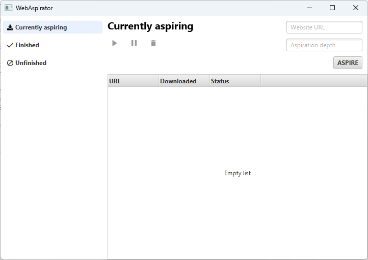
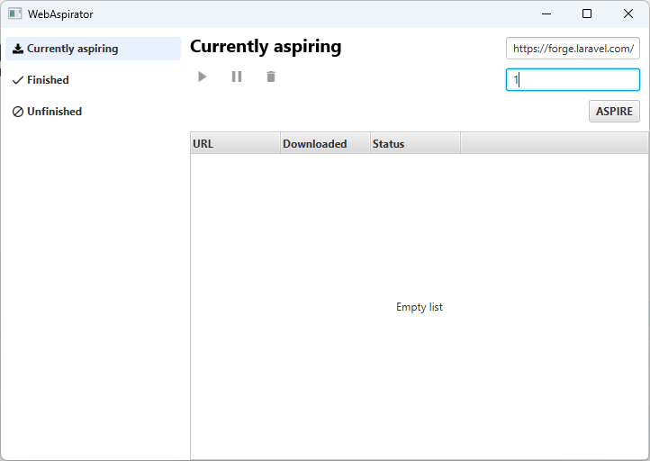
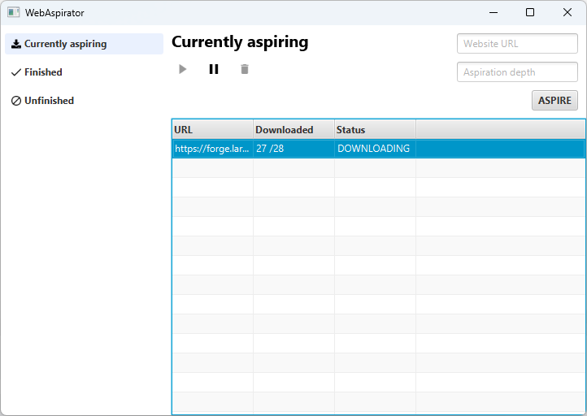
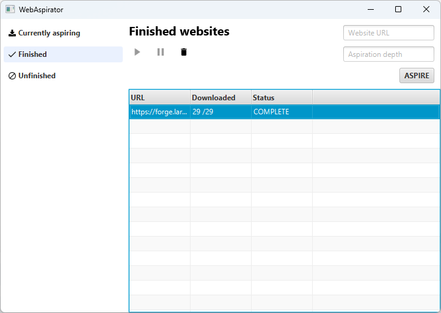
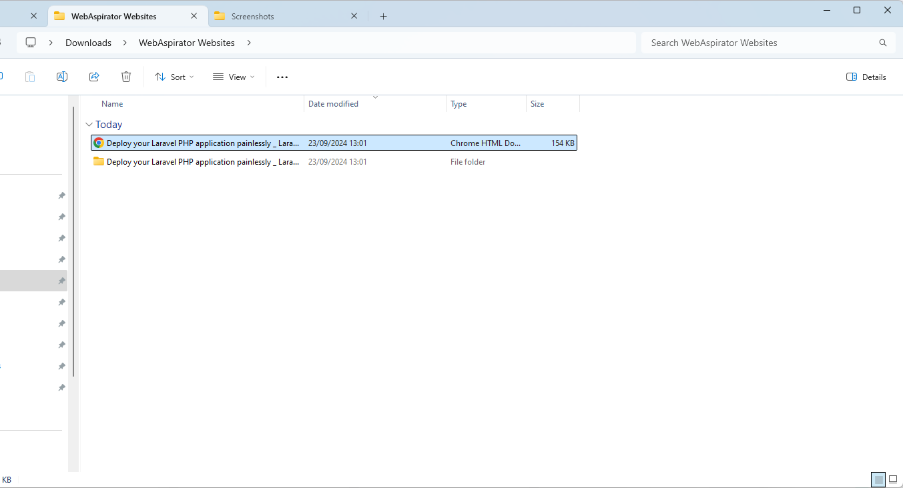

# WebAspirator

## Overview
**WebAspirator** is a desktop app written in Java and JavaFX that basically manages website downloads, it makes use of the [**webaspirator-lib**](https://github.com/ramirafrafi/webaspirator-lib) library.

## Screenshots

### Launch screen

### New website download

### Current downloads screen

### Finished downloads screen

### Downloaded website in the `WebAspirator Websites` folder

